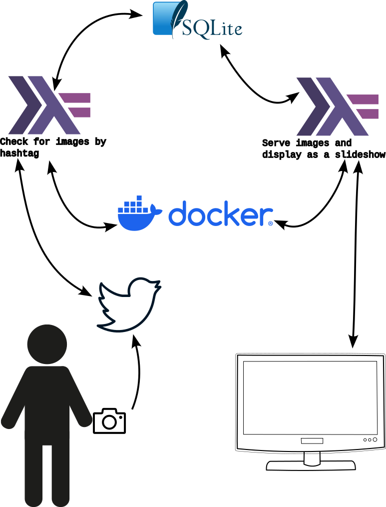

A Twitter slideshow server in Haskell
=================

Create a continuous slide show of pictures from Twitter. Modify the query in `src/TwitterPoller.hs` to choose what to search for. Useful for making a slideshow out of a unique hashtag for an event.

Keys / secrets
--------------
Store in private/

Running
-------
`docker-compose up`. Navigate to http://localhost:8001
